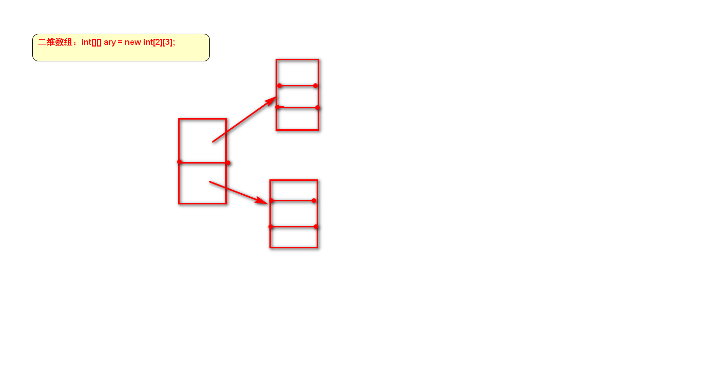
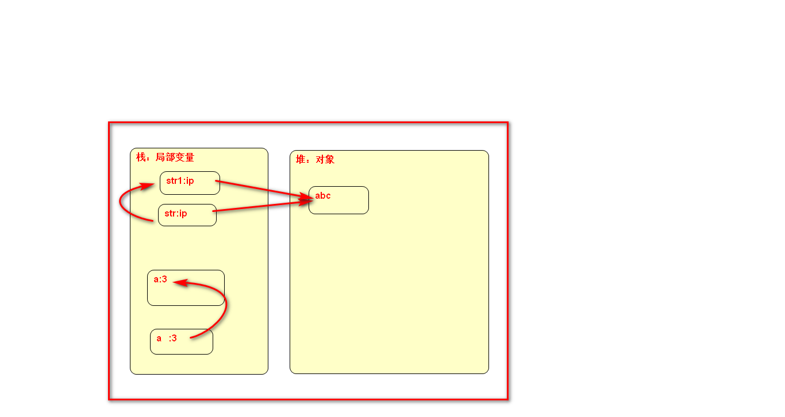
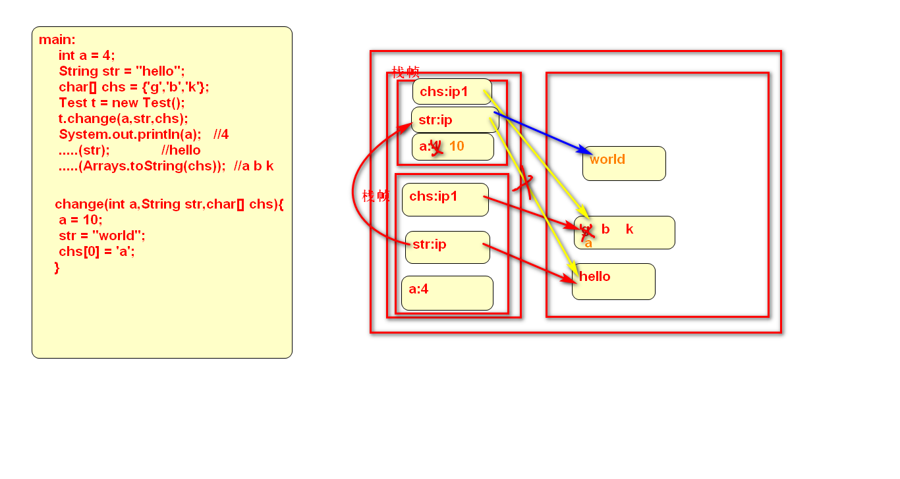
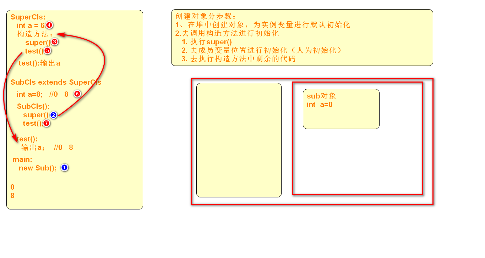

花倩
联系方式：微信：18612483268  

##java基础 -- 知识点和面试题穿插进行

###java基础：

1. 变量：
	1. 定义（声明和初始化）   数据类型  变量名 = value;
		1. 变量名的命名规范：  由数字，字母，_和$组成
			1. 不能以数字开头
			2. 推荐使用英文，不推荐中文（可以）
			3. 见名知意，驼峰命名法
			4. 不能使用java中关键字
2. 数据类型：
	1. 基本数据类型：8种
			
			byte           1字节
			short		   2字节	
			int			   4字节
			long		   8字节
			float		   4字节 -- 用的不是太多
			double         8字节
			char -- 字符   2字节
			boolean		   1字节

			面试题：字符串"java是种编程语言"，在java内存中所占用的大小是（）字节    A   容易误选B,C
					A. 20    	B.16     C.22    D.10

					解析：以上字符串中共有10个字符，而每个字符在内存中都占用2个字节，共占用20个字节
					误选B，C的原因是什么：
						编码UTF-8，一个中文占用3个字节，一个英文占用1个字节的，占用22个字节
						编码GBK，一个中文占用2个字节，一个英文占用1个字节的，占用16个字节

			1. 数据类型间的转换
				1. 自动转换（隐式转换）  --- 小转大，自动转
					1. byte-->short-->int-->long-->float-->double    boolean
					2. char-->int    
				2. 强制转换（显式转换）  --- 大转小，强制转
					1. 与以上的转换相反
					2. 格式：(类型)byte b = (byte)a;

				3. 强调点：
					
					char c = 'a';
					byte b = c;    //不可以 必须强制转换

					byte b1 = 1;
					c = b1;    //不可以，必须强转转换

					byte类型和short类型，若想和char类型进行转换，都必须强制转换
					byte，short，char都可以自动转换为int类型
			2. 不同数据类型间的运算问题
				1. 不同类型间进行运算，最终的运算结果一定是和最大类型保持一致。
				2. byte,short,char和int类型进行运算，最终结果一定是int类型，若想将结果赋值给byte，short，char，都必须强制转换
	2. 引用类型：java中所有的数据类型，除了基本数据类型外，其他的都是引用类型
		1. 常见的引用类型：     
			1. 数组   int[] ary = new int[4];
			2. 类  自定义类/java已经定义好的类作为类    String str = "abc";
			3. 抽象类，接口

3. 数组：
	1. 声明
		1. int[] ary;
		2. int ary[]; --不常用 ， 在底层代码的时候可能会见到
	2. 初始化
		1. int[] ary = {1,2,3};
		2. int[] ary = new int[4];   -- 数组中的每个元素都有默认值
			1. 数组中元素的默认值是什么取决于数组的类型：
				1. 类型是int[]   默认是0
				2. 类型是double[]   默认值：0.0
				3. 类型是引用类型  String[]   默认值为null
		3. int[] ary = new int[]{1,3};   --不常用

	3. 遍历--for循环
	4. 引用类型数组 -- 二维数组
		1. int[][] ary = new int[2][3];

			
		2. int[][] ary = {{1,2},{3,4,5},{6,7,8,9}};    

4. 运算符
	1. 强调点：+=  -=
		1. 题目：  
			
				byte b = 1;
				byte c = b+1;   //是否正确
					错误，原因：byte类型和1（int类型）进行运算，结果是int类型，若想转换为byte，需要强转
					
				b += 1;    //是否正确   
					正确，+=运算符自带强转功能，本质是在编译过程中转换  编译过程中代码转换为  b = (byte)(b+1);

				------11:05上课
5. 分支
	1. if  ...else  分支
		1. if...分支
		2. if...else if...else if...else...
		3. if...else分支

	2. switch分支
		1. 格式：
			
			switch(val/表达式){   --类型：int，String，枚举类型
				case  val:
					.....
					break;  ---强调点  ，可以不加，但是若不加，本条分支执行之后，顺序执行后面的分支，而不会跳出分支结构。
				case val:
					...
					break;
				.....
				default:
					.....
					break;
			}
	3. break关键字：
		1. 作用在分支结构中，表示跳出分支。
			
6. 循环
	1. while循环
	2. do..while循环
		1. 强调点:以上2种循环的区别：
			1. while循环是先判断，后执行
			2. do...while循环是先执行后判断，  ---循环体至少会执行1遍
	3. for循环 --使用频率最高的
		1. for(初始化;判断条件;迭代)

	4. 强调点：三种循环---死循环
		1. while(true){....}
		2. do{...}while(tru);
		3. for(;;)

	5. break,continue关键字
		1. break:
			1. 可以作用在分支结构中，表示跳出分支
			2. 可以作用在循环中，表示跳出当前循环

		2. cotinue：
			1. 作用在循环中，表示跳出本次循环，继续下次循环

			题目：
				for(int i=0;i<5;i++){
					for(int j=0;j<=i;j++){
						if(j==3){
							break;
						}
						System.out.print(j); 
					}
					System.out.println(i); 
				}

			0  0
			0  1  1
			0  1  2  2
			0  1  2  3
			0  1  2  4

			for(int i=0;i<5;i++){
				for(int j=0;j<=i;j++){
					if(j==3){
						continue;
					}
					System.out.print(j); 
				}
				System.out.println(i); 
			}
		结果：
			0  0
			0  1  1
			0  1  2  2
			0  1  2  3
			0  1  2  4  4

		题目：所谓“水仙花”数是一个三位数的整数，该整数等于各个位上的数字立方之和，例如：153=1*1*1+5*5*5+3*3*3，下面的程序用于输出100-1000内的水仙花数：

			for(int n=100；n<=1000;n++){
				空白处
				if(s==n){
					System.out.println(n);
				}
			}

			下列选项中，空白处可以填入的代码是（AC）
			A. int s=0,n1=n;  while(n1>0){int t=n1%10;  s+= t*t*t; n1/=10;}
			B. int s=0,n1=n;  while(n1>0){int t=n1/10;  s+= t*t*t; n1%=10;}
			C. int s=0;  for(int n1=n;n1>0;n1/=10){int t = n1%10; s+=t*t*t;}
			D. int s=0;  for(int n1=n;n1>0;n1%=10){int t = n1/10; s+=t*t*t;}
		
			注意：for循环中结构中三部分的执行顺序
7. 方法
	1. 结构：
		1. 访问控制修饰符  返回值类型  方法名(参数列表){方法体}

			public int getAge(int a){
				System.out.println(a);
				return a;
			}

	2. 强调点：问：java中的参数传递是值传递还是引用传递？
		1. java中的所有参数传递都是值传递   ---java中明确给出的定义。

			class Test{
				public void test(){
					int a = 3;
					demo(a);
					String str = "abc";
					demo1(str);
				}
				public void demo(int a){
					....
				}
				public void demo1(String str1){...}  将对象的地址的值传递过来
					
			}

			

	3. 练习题： -- 可变参数  int...is

			下列程序

			class Test{
				public static void main(String[] args){
					doSomething(1);
					doSomething(1,2);
				}
				//插入代码处
			}
	
			在程序插入下列哪一行代码编译是正确的（BD）
			A. static void doSomething(int[] args){}
			B. static void doSomething(int...args){}
			C. static void doSomething(int...args,int x){}
			D. static void doSomething(int x,int...args){}

			可变参数：
				格式：  数据类型...变量名
			注意点：
				1. 若参数列表中有多个参数，那么可变参数一定是位于参数列表的最后
				2. 参数列表中最多只能有一个可变参数
				3. 可变参数的本质是数组，所以传参时，可以传递一个数组给可变参数
				4. 因为可变参数的本质是数组，所以可变参数的访问和数组的访问方式相同

	4. 方法重载：over
	5. load
		1. 规则：在一个类中，存在多个方法，方法名相同，参数列表不同，这些方法就构成了方法重载
			1. 注意：方法重载和方法的返回值类型以及访问控制修饰符无关。

	5. 冒泡排序--重要 -- 重点掌握
			1. 自己下来看，多写

##OOP

###类和对象

1. 类是一类事物的模板，对象是经由这个模板创建出来的一个具体实例。
2. 对象的创建：
	1. new 类名();
	2. 如何引用该对象，
		1. 类  引用 = new 类名();  之后就可以通过该引用来访问对象内部的数据。。。
		2. Person person = new Person();   person.属性/方法
3. 构造方法：
	1. 无参构造方法
		
			class T{
				public T(){}
			}
	2. 有参构造方法

			class T{
				private int a;
				private String str;
				public T(int a,String str){
					this.a = a;
					this.str = str;
				}
			}
	3. this:是一个引用，指向一个对象
		1. 指向的调用当前方法的对象
		2. 通常在方法中可以省略不写,但是在有歧义的情况下，this不能省略（典型的案例：有参构造方法）

				public class T{
					int a;
					public void test(){
						a = 3;
						System.out.println(ta);
					}
				}

	4. 注意点：
		1. 若一个类中不显式的定义构造方法，默认该类有存在无参构造方法
		2. 若一个类中显式的定义了有参构造方法，而没有显式的定义无参构造方法，此时，该类中不存在无参构造方法
		3. 构造方法的作用：进行初始化的。

###内存管理

1. 方法区：保存的是所有类的信息，类中的方法的代码，static变量，static代码块
2. 栈：保存的是局部变量，方法参数列表中的参数（局部变量）
	1. 栈帧：内存为每个要执行的方法都会分配一块区域，用于保存该方法内部的所有局部变量，就叫做栈帧区域
	2. 局部变量在内存中的生命周期：
		1. 当方法开始执行，局部变量创建，在方法执行过程中被使用，当方法执行结束，对应的栈帧区域随之销毁。
3. 堆：对象，实例变量（成员变量）
	1. 对象/实例变量在内存中的生命周期：
		1. 当代码执行到创建对象时，在内存中创建，可以通过引用来使用对象中的数据和方法，当某对象没有任何引用指向时，表示该对象成为了垃圾，等待被GC回收，当GC回收之后，该对象被回收（销毁）。

		public class T{
			public int a;//实例变量  问题：在外部如何访问a  --属于对象
			static String str;

			static{
				.....//静态资源
			}
			public void test(){....}
		}

		public class A{
			main:
				T t = new T();
				t.a = ?;
				System.out.println(t.a);
		}

		练习题：画出以下代码中数据在内存中的内存示意图：
			public class Test{
				main:
					int a = 4;
					String str = "hello";
					char[] chs = {'g','b','k'};
					Test t = new Test();
					t.change(a,str,chs);
					System.out.println(a);   //4
					.....(str);             //hello
					.....(Arrays.toString(chs));  //a b k
	

				change(int a,String str,char[] chs){
					a = 10;
					str = "world";
					chs[0] = 'a';
				}
			}

	
4. GC：垃圾回收机制
	1. GC对程序员 来说是透明的，即程序员无法得知GC什么时候回收。
	2. System.gc() -- 建议GC来回收某对象	
		1. finalize() -- 是Object类中的方法，该方法通常会被子类重写，用于对象销毁前做最后的资源清理。
			1. 即当GC销毁某对象时，会调用该对象内部的finalize方法，来做 最后的资源释放工作。	
5. 内存溢出和内存泄漏的区别？
	1. 内存溢出：当JVM所能提供的内存不足以分配给请求的资源时，就会造成内存溢出。
	2. 内存泄漏：当JVM的内存分配出去之后，没有回收回来，就造成内存泄漏。
		1. 关系：内存泄漏积累到一定程序会造成内存溢出。
	

###继承

1. 语法：  extends    class Sub  extends Super
2. 继承的特点：
	1. 单一性：java中的子类只能有一个父类
	2. 传递性：class A extends B    B  extends  C   A类也继承了C 类中的内容

3. 重写：override
	1. 是指在具有继承关系的父子类中，子类中对父类中的某个方法的方法体进行重新实现。
	2. 规则：2同2小1大
		1. 方法名，参数列表必须相同
		2. 方法的返回值类型  子类<=父类
		3. 方法抛出的异常类型   子类<=父类
		4. 方法的访问控制修饰类型   子类>=父类

		重载和重写：
			重载：同一个类中存在多个方法，方法名相同，参数列表不同，就构成重载，和方法的其他部分无关
			重写：父子类中，存在方法名，参数列表必须相同，和其他部分也有关。

	3. 可以通过父类类型的引用指向子类对象，也可以通过子类类型的引用指向子类对象，不论是父类类型还是子类类型的引用，若指向的子类对象，那么通过该引用调用到的方法一定是子类重写后的方法（调用的方法是被重写的）

			class Person    class Student extends Person   student类中重写person类中的say()方法
			Student stu = new Student();
			Person per = new Student();  //向上造型
			per/stu.say() --重写后的方法

4. 继承中构造方法的调用问题：
	1. 若创建某子类对象，一定是先调用父类的构造方法，在执行子类的构造方法

			class Super{
				public Super(){
					super();  //调用父类的无参构造方法
					.....
				}
			}

			class Sub extends Super{
				public Sub(){}
			}

			main:
				new Sub();

####题目--创建对象以及初始化的过程

	public class Super{
		int a = 6;
		public Super(){
			test();     //调用的是子类的还是父类中的方法，看运行过程中创建的对象是谁。
						// Person per = new Student();   per.say();  //子类的，看对象在运行时是谁
		}
		public void test(){
			System.out.println(a);
		}
		
	}

	public class Sub extends Super{
		int a = 8;
		public Sub(){
			super();
			test();
		}

		public void test(){
			System.out.println(a);   
		}
		public static void main(String[] args){
			new Sub();
		}
	}    
	 

###static和final关键字

1. static
	1. 成员变量：静态成员变量
		1. 通过类名调用的，属于类的，保存在方法区的
		2. 会在类加载时期完成初始化
	2. 方法：
		1. 属于类的，通过类名调用，方法代码保存在方法区
	3. 代码块：
		1. static{代码。。。。。}
		2. 使用场景：当一些代码是静态（不变）资源时，就可以用static来修饰
		3. 执行时机：是在类加载时期执行的，程序启动一次，只执行一次。

2. final：
	1. 类：类不可以被 继承
	2. 方法：方法不可以被重写
	3. 变量：变量的值一旦初始化，值不可以改变。
		1. final修饰的变量是成员变量还是局部变量？--二者都可以

3. static和final可以共同修饰成员变量，此时成员变量就成为了常量。
	1. 常量的命名有规范：所有字母都 大写，且若由多个单词组成，用_隔开

			static final int STUDENT_AGE=4;

##抽象和接口

1. 抽象：abstract
	1. 修饰方法：抽象方法  --- 只有方法的声明，没有方法的实现（没有方法体）
	2. 修饰类：抽象类 -- 为了将多个子类的共同内容提取出来，以供子类公用
	3. 抽象类是用于继承的。
2. 抽象类和抽象方法的关系：
	1. 若一个类中有抽象方法，那么这个类一定是抽象类；但若一个类是抽象类，该类中不一定有抽象方法。
	2. 抽象类不可以被实例化，但是抽象类中是有构造方法的

3. 接口:interface
	1. 实现方式：  implements
	2. 用法：  class A  implements  interface B
	3. 接口中的成员：2种
		1. 常量
		2. 抽象方法

				注意点：
					1. 接口中定义常量时，可以省略 public static  final，因为接口中默认提供了以上3个修饰符定义常量时可以写成  ：  int  STATE = 0;
					2. 接口中定义抽象方法时，可以public abstract，因为接口默认提供，所以定义时可以写成
						1. void  test();
					

	4. 接口不可以被实例化的，接口中没有构造方法，没有变量，没有普通方法（暂时保留，后续版本中可以有）
	5. 注意点：
		1. java中接口是多实现的，即一个类可以实现多个接口
			1. class A implements interfaceA,interfaceB....
		2. java中接口之间是可以继承的，且可以多继承。
			1. interface A extends interfaceB,interfaceC....
		3. 某个类可以在继承父类的同时实现一个或多个接口，但是一定是继承在前，实现接口在后。
			1. class A extends Super implements interfaceA,interfaceB....

####内部类

1. 普通内部类：在外部类的内部定义一个类
	1. 用途/意义：通常是服务于外部类的。
	2. 使用：通常会在外部类的某方法内部，或成员变量位置创建内部类对象

			class Outter{
			//	InnerCls inner = new InnerCls();
				int a = 8;
				public void test(){
					InnerCls inner = new InnerCls();
					inner.b = 6;
					inner.demo();
				}
				class InnerCls{
					int b = 4;
					public void demo(){....}

				}
			}

	3. 内部类可以访问外部类的成员，包括私有成员

2. 匿名内部类：
	1. 用法：通常用于实现/继承java已经定义好的某个接口/抽象类/类
	2. 使用时机：若创建的某个类的对象只在一个位置 使用，此时就可以定义成匿名内部类
	3. 语法：
		1. 接口 引用 = new 接口(){
		2.    重写接口中的抽象方法
		3. }

	4. Runnable接口 -- 线程中学习，内部有抽象方法run()

			Runnable task = new Runnable() {
			
				@Override
				public void run() {
					System.out.println("匿名内部类测试");
				}
			};
			
			task.run();

			Foo foo = new Foo() {
			
				@Override
				public void demo() {
					System.out.println("demo方法匿名测试");
				}
			};
			
			foo.demo();

3. lambda表达式：替换了一部分匿名内部类
	1. 当使用匿名内部类实现的接口是功能性接口时，可以使用lambda表达式
		1. 功能性接口：当接口中只有一个抽象方法时，该接口就叫做功能性接口

	2. jdk1.8开始出现的新特性
	3. 语法：
		1. ()->{}    ():表示实现接口后重写的方法的参数列表   {}：表示重写的方法的方法体
			1. 若方法体中只有一行代码，此时，{}可以 省略
		

	